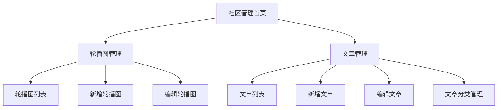

# 社区管理模块产品需求文档

## 1. 产品概述

社区管理模块是医院管理系统的内容管理功能，主要用于管理医院官网和移动端的轮播图展示和文章内容发布。
- 解决医院宣传内容统一管理和发布的需求，提供轮播图和文章的完整生命周期管理功能。
- 目标用户为医院的内容运营人员和管理员，帮助提升医院品牌形象和信息传播效率。

## 2. 核心功能

### 2.1 用户角色

| 角色 | 注册方式 | 核心权限 |
|------|----------|----------|
| 内容管理员 | 系统管理员分配 | 可管理轮播图和文章的增删改查 |
| 超级管理员 | 系统预设 | 拥有所有权限，可管理内容管理员 |

### 2.2 功能模块

社区管理模块包含以下主要页面：
1. **轮播图管理页面**：轮播图列表展示、图片上传、排序设置、状态管理。
2. **文章管理页面**：文章列表展示、富文本编辑、分类管理、发布状态控制。

### 2.3 页面详情

| 页面名称 | 模块名称 | 功能描述 |
|----------|----------|----------|
| 轮播图管理页面 | 轮播图列表 | 展示所有轮播图，支持搜索、筛选、分页浏览 |
| 轮播图管理页面 | 图片上传 | 支持单张或批量上传图片，自动压缩和格式转换 |
| 轮播图管理页面 | 排序管理 | 拖拽排序，设置轮播图显示顺序 |
| 轮播图管理页面 | 状态控制 | 启用/禁用轮播图，设置展示时间范围 |
| 文章管理页面 | 文章列表 | 展示所有文章，支持按标题、作者、分类、状态筛选 |
| 文章管理页面 | 富文本编辑器 | 创建和编辑文章内容，支持图片、视频、链接插入 |
| 文章管理页面 | 分类管理 | 创建和管理文章分类，支持多级分类 |
| 文章管理页面 | 发布管理 | 文章发布、撤回、定时发布功能 |

## 3. 核心流程

**内容管理员操作流程：**
1. 登录系统 → 进入社区管理 → 选择轮播图管理或文章管理
2. 轮播图管理：上传图片 → 设置标题和链接 → 调整排序 → 启用展示
3. 文章管理：创建文章 → 编辑内容 → 选择分类 → 发布或保存草稿

## 4. 用户界面设计

### 4.1 设计风格

- **主色调**：#1890ff（蓝色）、#52c41a（绿色）
- **辅助色**：#f0f0f0（浅灰）、#ffffff（白色）
- **按钮样式**：圆角按钮，主要操作使用蓝色，危险操作使用红色
- **字体**：系统默认字体，标题16px，正文14px，辅助文字12px
- **布局风格**：卡片式布局，顶部导航，左侧面包屑导航
- **图标风格**：使用Ant Design图标库，简洁现代风格

### 4.2 页面设计概览

| 页面名称 | 模块名称 | UI元素 |
|----------|----------|--------|
| 轮播图管理页面 | 轮播图列表 | 表格布局，缩略图预览，操作按钮组，分页器 |
| 轮播图管理页面 | 新增/编辑表单 | 模态框，图片上传组件，表单验证，拖拽排序 |
| 文章管理页面 | 文章列表 | 表格布局，状态标签，搜索筛选栏，批量操作 |
| 文章管理页面 | 文章编辑器 | 全屏编辑模式，富文本编辑器，侧边栏设置面板 |

### 4.3 响应式设计

采用桌面优先的响应式设计，支持平板和移动端适配，编辑功能主要针对桌面端优化，移动端提供基础的查看和简单编辑功能。