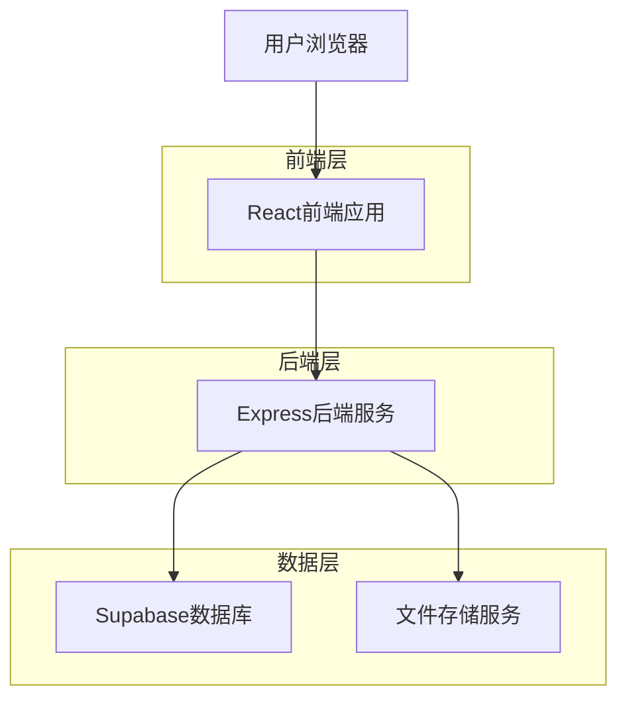
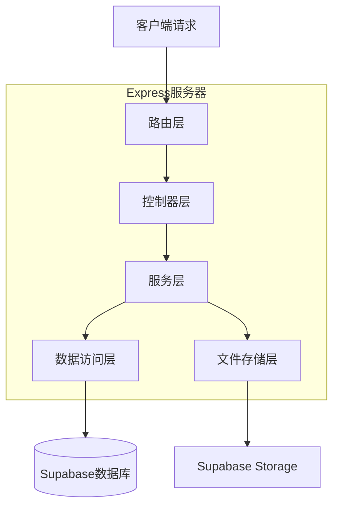
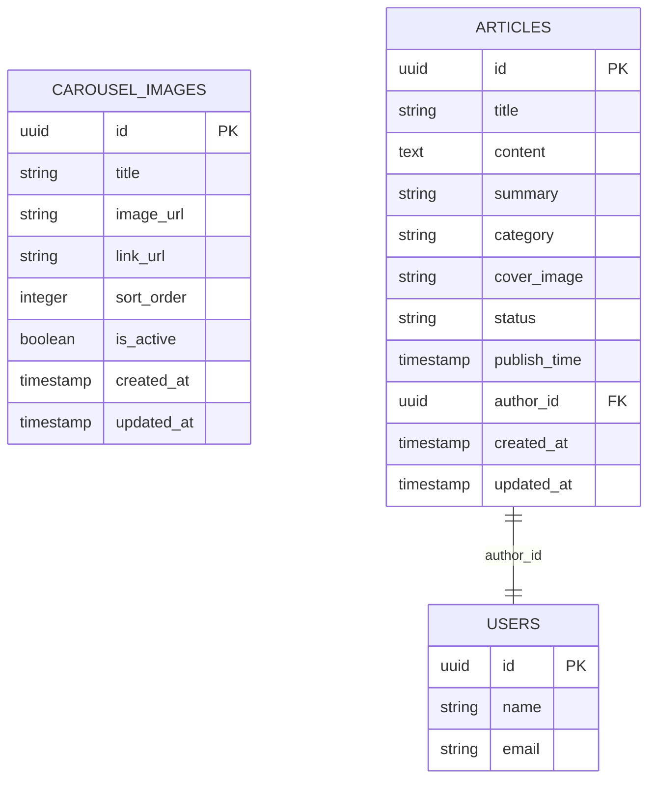

# 社区管理模块技术架构文档

## 1. 架构设计



## 2. 技术描述

* **前端**：React\@18 + TypeScript + Ant Design + Vite

* **后端**：Express\@4 + TypeScript + Supabase SDK

* **数据库**：Supabase (PostgreSQL)

* **文件存储**：Supabase Storage

## 3. 路由定义

| 路由                           | 用途                   |
| ---------------------------- | -------------------- |
| /community                   | 社区管理首页，显示模块概览和快捷入口   |
| /community/carousels         | 轮播图管理页面，展示轮播图列表和管理功能 |
| /community/articles          | 文章管理页面，展示文章列表和编辑功能   |
| /community/articles/create   | 新建文章页面，提供富文本编辑器      |
| /community/articles/edit/:id | 编辑文章页面，编辑指定文章内容      |

## 4. API定义

### 4.1 轮播图管理API

**获取轮播图列表**

```
GET /api/carousels
```

请求参数：

| 参数名    | 参数类型   | 是否必需  | 描述                       |
| ------ | ------ | ----- | ------------------------ |
| page   | number | false | 页码，默认1                   |
| limit  | number | false | 每页数量，默认10                |
| status | string | false | 状态筛选：active/inactive/all |

响应：

| 参数名     | 参数类型    | 描述      |
| ------- | ------- | ------- |
| success | boolean | 请求是否成功  |
| data    | object  | 轮播图列表数据 |
| total   | number  | 总数量     |

**创建轮播图**

```
POST /api/carousels
```

请求参数：

| 参数名         | 参数类型    | 是否必需  | 描述          |
| ----------- | ------- | ----- | ----------- |
| title       | string  | true  | 轮播图标题       |
| image\_url  | string  | true  | 图片URL       |
| link\_url   | string  | false | 点击跳转链接      |
| sort\_order | number  | false | 排序顺序        |
| is\_active  | boolean | false | 是否启用，默认true |

**更新轮播图**

```
PUT /api/carousels/:id
```

**删除轮播图**

```
DELETE /api/carousels/:id
```

### 4.2 文章管理API

**获取文章列表**

```
GET /api/articles
```

请求参数：

| 参数名      | 参数类型   | 是否必需  | 描述                       |
| -------- | ------ | ----- | ------------------------ |
| page     | number | false | 页码，默认1                   |
| limit    | number | false | 每页数量，默认10                |
| status   | string | false | 状态筛选：published/draft/all |
| category | string | false | 分类筛选                     |
| search   | string | false | 标题搜索关键词                  |

**创建文章**

```
POST /api/articles
```

请求参数：

| 参数名           | 参数类型   | 是否必需  | 描述                   |
| ------------- | ------ | ----- | -------------------- |
| title         | string | true  | 文章标题                 |
| content       | string | true  | 文章内容（HTML格式）         |
| summary       | string | false | 文章摘要                 |
| category      | string | false | 文章分类                 |
| cover\_image  | string | false | 封面图片URL              |
| status        | string | false | 发布状态：draft/published |
| publish\_time | string | false | 定时发布时间               |

**更新文章**

```
PUT /api/articles/:id
```

**删除文章**

```
DELETE /api/articles/:id
```

### 4.3 文件上传API

**上传图片**

```
POST /api/upload/image
```

请求：multipart/form-data格式

| 参数名  | 参数类型   | 是否必需  | 描述                    |
| ---- | ------ | ----- | --------------------- |
| file | File   | true  | 图片文件                  |
| type | string | false | 上传类型：carousel/article |

响应：

| 参数名     | 参数类型    | 描述      |
| ------- | ------- | ------- |
| success | boolean | 上传是否成功  |
| url     | string  | 图片访问URL |

## 5. 服务器架构图



## 6. 数据模型

### 6.1 数据模型定义



### 6.2 数据定义语言

**轮播图表 (carousel\_images)**

```sql
-- 创建轮播图表
CREATE TABLE carousel_images (
    id UUID PRIMARY KEY DEFAULT gen_random_uuid(),
    title VARCHAR(255) NOT NULL,
    image_url TEXT NOT NULL,
    link_url TEXT,
    sort_order INTEGER DEFAULT 0,
    is_active BOOLEAN DEFAULT true,
    created_at TIMESTAMP WITH TIME ZONE DEFAULT NOW(),
    updated_at TIMESTAMP WITH TIME ZONE DEFAULT NOW()
);

-- 创建索引
CREATE INDEX idx_carousel_images_sort_order ON carousel_images(sort_order);
CREATE INDEX idx_carousel_images_is_active ON carousel_images(is_active);
CREATE INDEX idx_carousel_images_created_at ON carousel_images(created_at DESC);

-- 设置RLS权限
GRANT SELECT ON carousel_images TO anon;
GRANT ALL PRIVILEGES ON carousel_images TO authenticated;

-- 初始化数据
INSERT INTO carousel_images (title, image_url, link_url, sort_order, is_active) VALUES
('医院首页轮播图1', 'https://example.com/carousel1.jpg', 'https://example.com/page1', 1, true),
('医院首页轮播图2', 'https://example.com/carousel2.jpg', 'https://example.com/page2', 2, true);
```

**文章表 (articles)**

```sql
-- 创建文章表
CREATE TABLE articles (
    id UUID PRIMARY KEY DEFAULT gen_random_uuid(),
    title VARCHAR(500) NOT NULL,
    content TEXT NOT NULL,
    summary TEXT,
    category VARCHAR(100),
    cover_image TEXT,
    status VARCHAR(20) DEFAULT 'draft' CHECK (status IN ('draft', 'published', 'archived')),
    publish_time TIMESTAMP WITH TIME ZONE,
    author_id UUID REFERENCES users(id),
    created_at TIMESTAMP WITH TIME ZONE DEFAULT NOW(),
    updated_at TIMESTAMP WITH TIME ZONE DEFAULT NOW()
);

-- 创建索引
CREATE INDEX idx_articles_status ON articles(status);
CREATE INDEX idx_articles_category ON articles(category);
CREATE INDEX idx_articles_author_id ON articles(author_id);
CREATE INDEX idx_articles_publish_time ON articles(publish_time DESC);
CREATE INDEX idx_articles_created_at ON articles(created_at DESC);

-- 设置RLS权限
GRANT SELECT ON articles TO anon;
GRANT ALL PRIVILEGES ON articles TO authenticated;

-- 初始化数据
INSERT INTO articles (title, content, summary, category, status, author_id) VALUES
('医院新闻：新设备引进', '<p>我院引进了最新的医疗设备...</p>', '医院引进新设备，提升医疗服务质量', '医院新闻', 'published', (SELECT id FROM users LIMIT 1)),
('健康科普：预防感冒小贴士', '<p>秋冬季节如何预防感冒...</p>', '秋冬季节预防感冒的实用建议', '健康科普', 'published', (SELECT id FROM users LIMIT 1));
```

